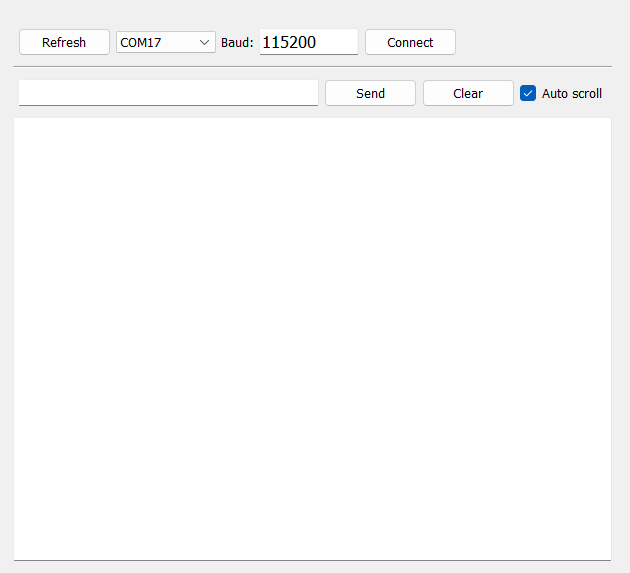

# Terminal Widget (PyQt5)

A reusable PyQt5 terminal-style widget

Designed to be embedded inside other PyQt applications as a normal widget.


---

## 📦 Installation (as Git submodule)

Add this repository as a submodule inside your project:

```bash
git submodule add https://github.com/<yourname>/terminal_widget.git
git submodule update --init --recursive
```

## 🚀 Usage

```python
from terminal_widget.terminal_widget import TerminalWidget

class Main_UI(QMainWindow):

    def __init__(self):
        super(Main_UI, self).__init__()
        uic.loadUi("main_ui.ui", self)

        self.load_terminal()

        self.show()

    def load_terminal(self):
        # Find the frame in the main UI where the terminal will be embedded
        self.terminal_frame = self.findChild(QFrame, "frame")
        layout = self.terminal_frame.layout()
        if layout is None:
            layout = QtWidgets.QVBoxLayout(self.terminal_frame)
            layout.setContentsMargins(0, 0, 0, 0)
            layout.setSpacing(0)

        self.terminal = TerminalWidget(parent=self.terminal_frame)
        layout.addWidget(self.terminal)
        self.terminal.connect_pressed.connect(self.connect_pressed)
        self.terminal.send_pressed.connect(self.send_pressed)

        self.settings_path = Path("settings.json")
        settings_data = {"port": "", "baudrate": 115200}
        if self.settings_path.exists():
            with open(self.settings_path, 'r') as f:
                settings_data = json.load(f)

            if "port" in settings_data:
                self.terminal.set_port(settings_data["port"])
            
            if "baudrate" in settings_data:
                self.terminal.set_baudrate(settings_data["baudrate"])


    def connect_pressed(self):
        baudrate = self.terminal.get_baudrate()
        port = self.terminal.get_port()
        print("Connecting to port:", port, "at baudrate:", baudrate)
        with open(self.settings_path, 'w') as f:
            json.dump({"port": port, "baudrate": baudrate}, f)
        
    def send_pressed(self, message):
        print("Sending message:", message)
```

